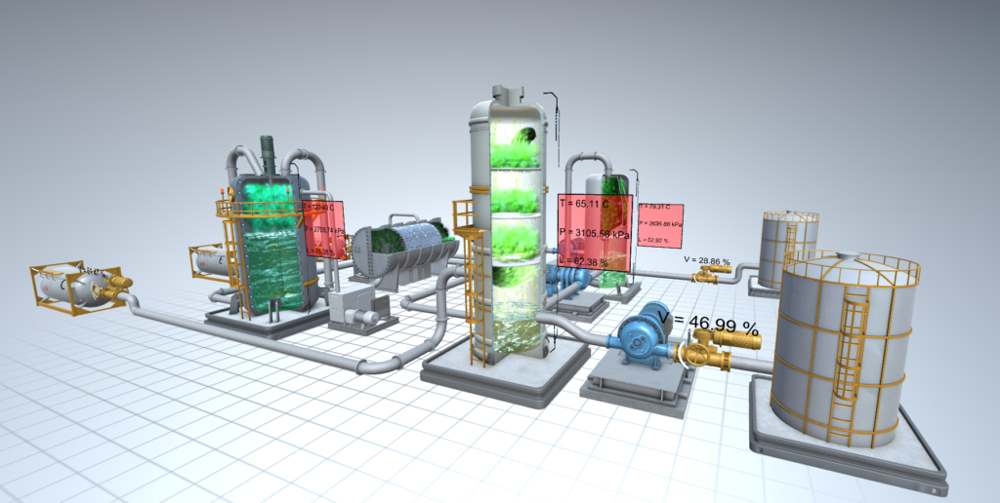
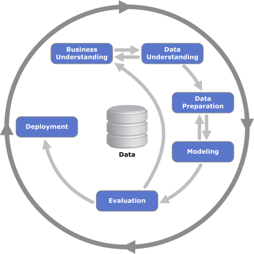

# Capstone Project
## :factory: LSTM Autoencoders: Detecting anomalies in the Tennessee Eastman Process

The main findings are summarized in a blog post you can read [here](https://medium.com/@victorspruela/lstm-autoencoders-detecting-anomalies-in-the-tennessee-eastman-process-6170b70a1d81)

### :muscle: Codes for LSTM Autoencoders: Detecting anomalies in the Tennessee Eastman Process

#### :**chart_with_upwards_trend**: The Data

The data used in this project can be downloaded from [Kaggle] (https://www.kaggle.com/datasets/averkij/tennessee-eastman-process-simulation-dataset).

#### :man_technologist: Installations

This project was developed using Python 3.9.7. The main packages and versions are listed below:

* keras==2.8.0
* tensorflow==2.8.0
* pandas==1.4.2
* numpy==1.21.5
* matplotlib==3.5.1
* seaborn==0.11.2
* scikit-learn==1.0.2

The complete list is available in the `requirements.txt` file. 

#### :memo: Files description

* LSTM Auto Encoder - EDA.ipynb: Jupyter Notebook with the project's exploratory data analysis
* LSTM Auto Encoder - Results.ipynb: Jupyter Notebook with the results analysis
* `evaluate_anomaly_detection.py`: script to used predict anomalies for a given dataset and autoencoder model
* `train_autoencoder.py`: script used to train the autoencoder
* `model\autoencoder.py`: contains the autoencoder implementation
* `data\process.py`: contains the a helper class to load the TEP datasets
* `data\plot.py`: contains helper functions used to plot the analysis results
* `data\utils.py`: general helper functions
* `report` folder: contains all images used in the blog post.

### :mag_right: Methodology
This project follows CRISP-DM phases:

In the Data Understanding step, some research questions were set and answered:

* What are the dynamics of the Tenessee Eastman process?
* Are controlled and measured variables correlated?
* Can we predict anomalous operational conditions?

In the Data Processing step, we check the data quality, scale it and remove collinear features with a correlation analysis. 

In the Modeling phase, we propose to train a model to capture the behavior of normal operational conditions. This was done using the LSTM autoencoder model. Next, we define a threshold based on normal simulations resconstruction error and use it to flag anomalous operations for the faulty datasets. Finally, we analyze the proposed technique's accuracy.

# :books: Acknowledgments

### Academic References
* Downs, James J., and Ernest F. Vogel. “A plant-wide industrial process control problem.” Computers & chemical engineering 17.3 (1993): 245–255.
* Malhotra, Pankaj, et al. “LSTM-based encoder-decoder for multi-sensor anomaly detection.” arXiv preprint arXiv:1607.00148 (2016).
* Mu, Ke, et al. “Industrial process monitoring and fault diagnosis based on temporal attention augmented deep network.” Journal of Information Processing Systems 17.2 (2021): 242–252.
* Ren, Jiayang, and Dong Ni. “A batch-wise LSTM-encoder decoder network for batch process monitoring.” Chemical Engineering Research and Design 164 (2020): 102–112.

### Other resources
* https://towardsdatascience.com/lstm-autoencoder-for-anomaly-detection-e1f4f2ee7ccf
* https://colah.github.io/posts/2015-08-Understanding-LSTMs/
* https://www.jeremyjordan.me/autoencoders/
* https://towardsdatascience.com/anomaly-detection-for-dummies-15f148e559c1
* https://www.jeremyjordan.me/autoencoders/

This project was developed as part of the requirements for Data Scientist Udacity Nanodegree.