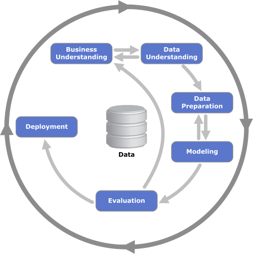

# Project 1 - Writing a Blog Post
## :bicyclist: Why Does it Matter to Analyze your Indoor Cycling Training Data 

The main findings are summarized in a blog post you can read [here](https://medium.com/@victorspruela/why-does-it-matter-to-analyze-your-indoor-cycling-training-data-cfc0cbd2cbe9)

### :muscle: Codes for Why Does it Matter to Analyze your Indoor Cycling Training Data

#### :chart_with_upwards_trend: The Data

The data used in this project can be downloaded from this [link](https://github.com/vicrsp/udacity-ds-2022/blob/main/src/project_01/performances_wattbike_self.csv).

#### :man_technologist: Installations

This project was developed using Python 3.9.7. The main packages and versions are listed below:
* pandas==1.4.1
* numpy==1.21.5
* matplotlib==3.5.0
* seaborn==0.11.2
* scikit-learn==1.0.2
* scipy==1.7.3

The complete list is available in the requirements.txt file. 

#### :memo: Files description

* [post_notebook.ipynb](https://github.com/vicrsp/udacity-ds-2022/blob/main/src/project_01/post_notebook.ipynb): Jupyter Notebook with te project's source code
* weight_fit.json: raw weight data exported from Google Fit
* pre_process.py: contains helper functions to pre-process raw weight and performance data. generates the performances_self.csv and weight_self.csv files.
* weight_self.csv: pre-processed weight data from JSON file.
* performances_wattbike_self.csv: contains my personal performance data.
* images folder: contains all images used in the project.

### :mag_right: Methodology
This project follows CRISP-DM phases:

In the Data Understanding step, some research questions were set and answered:

* How is my performance evolving over time?
* How good is my pedaling technique?
* Can I group training sessions into different categories?

In the Modeling phase, we propose to group training performance based on the most relevant cycling statistics. It was done using hierarquical clustering to find the most
relevante features, reducing the dimensionality of the dataset. Next, K-means clustering is applied to the selected features and an optimum amount of three clusters were found
based on the Elbow curve method.

# :books: Acknowledgments

All the effort put into the Wattbikes by the DCycle crew  

Remove multicollinear variables using hierarquical clustering. This techinque is inspired from this https://scikit-learn.org/stable/auto_examples/inspection/plot_permutation_importance_multicollinear.html

This project was developed as part of the requirements for Data Scientist Udacity Nanodegree.
