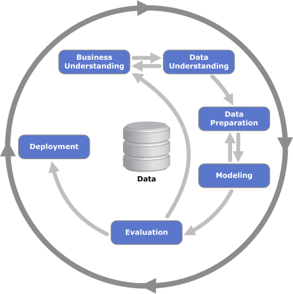

# Project 2 - Disaster Response Pipelines

## :helicopter: Project Description

In this project, a model was built to classify messages that are sent during disasters. There are 36 pre-defined response categories per message, and by classifying them, we can be properly assig them to their respective disaster relief agency. The problem in hand is a multi-label classification task, because a message can belong to one or more categories. The dataset was kindly provided by (Appen)[https://www.figure-eight.com/], containing real messages that were sent during disaster events.

The project involved the construction of an ETL and Machine Learning pipelines, which is essential for deploying the model and consuming its predictions. A webapp was developed to enable anyone can input a message and see its classification. It is also possible to see some interesting visualizations of the dataset.

## :chart_with_upwards_trend: The Data

The data used in this project is available in the `data` folder. Raw data is stored in `.csv` files. The processed data is stored in a SQLite database: `DisasterResponse.db`.

## :man_technologist: Installations

This project was developed using Python 3.6.3. The main packages and versions are listed below:

* joblib==1.1.0
* nltk==3.2.5
* numpy==1.19.5
* pandas==0.23.3
* scikit-learn==0.19.1
* scipy==1.2.1
* SQLAlchemy==1.4.32
* Flask==2.0.3
* plotly==5.6.0

## :briefcase: Usage

- To run ETL pipeline that cleans data and stores in database:
        `python data/process_data.py data/disaster_messages.csv data/disaster_categories.csv data/DisasterResponse.db`
- To run ML pipeline that trains classifier and saves:
    `python models/train_classifier.py data/DisasterResponse.db models/classifier.pkl`
- To run the webapp:
    `python app/run.py`
## :memo: Files description

* `data/process_data.py`: processes the raw data and store in the SQLite database
* `models/train_classifier.py`: trains, evaluates and saves the model.
* `app/run.py`: loads the model and loads the webapp with the dashboard and manual predictions.

## :mag_right: Methodology
This project follows CRISP-DM methodology:

In the Data Preparation phase, we clean and merge the two data sources. Then, the `nltk` package is used to case normalize, lemmatize, and tokenize the text messages. After that, we vectorize and then apply TF-IDF to prepare the data for classification.

In the Modeling phase, the processed messages are classified. It was done using the Random Forest classfication algorithm. The model's hyperparameters are tuned using a grid search with cross-validation. The following parameters are considered in the search:

* n_estimators: number of trees in the forest.
* min_samples_split: minimum number os samples in a node split.
* max_depth: the maximum depth of the tree.

The complete dataset is split into train and test. The cross-validation is executed in the training dataset. The precision, recall and f1 metrics are used to evaluate the model on the test set.
## :balance_scale: Evaluation Metrics

The precision, recall and f1 scores for the test dataset is displayed in the table below. 

Overall, the model is doing a good job! Only a few classes have small value for the metrics and on average all they are above 92%!

| **class** 	| **precision** 	| **recall** 	| **f1** 	|
|---	|:---:	|:---:	|:---:	|
| related 	| 0.88 	| 0.86 	| 0.84 	|
| request 	| 0.95 	| 0.94 	| 0.94 	|
|  offer 	| 0.95 	|  0.97 	|  0.96 	|
|  aid_related 	| 1.00 	| 1.00 	| 1.00 	|
|  medical_help 	| 0.95 	| 0.94 	| 0.93 	|
|  medical_products 	| 1.00 	| 0.97 	| 0.99 	|
|  search_and_rescue 	| 0.89 	| 0.89 	| 0.89 	|
|  security 	| 1.00 	| 1.00 	| 1.00 	|
|  military 	| 0.95 	| 0.94 	| 0.94 	|
|  child_alone 	| 0.9 	| 0.89 	| 0.87 	|
|  water 	| 0.92 	| 0.92 	| 0.9 	|
|  food 	| 0.92 	| 0.92 	| 0.89 	|
|  shelter 	| 0.84 	| 0.81 	| 0.74 	|
|  clothing 	| 1.00 	| 1.00 	| 1.00 	|
|  money 	| 0.85 	| 0.81 	| 0.75 	|
|  missing_people 	| 1.00 	| 0.97 	| 0.99 	|
|  refugees 	| 1.00 	| 1.00 	| 1.00 	|
|  death 	| 1.00 	| 1.00 	| 1.00 	|
|  other_aid 	| 0.97 	| 0.97 	| 0.97 	|
|  infrastructure_related 	| 0.98 	| 0.94 	| 0.96 	|
|  transport 	| 0.99 	| 0.97 	| 0.98 	|
|  buildings 	| 0.92 	| 0.92 	| 0.9 	|
|  electricity 	| 1.00 	| 0.97 	| 0.99 	|
|  tools 	| 1.00 	| 1.00 	| 1.00 	|
|  hospitals 	| 0.95 	| 0.97 	| 0.96 	|
|  shops 	| 0.98 	| 0.97 	| 0.97 	|
|  aid_centers 	| 1.00 	| 1.00 	| 1.00 	|
|  other_infrastructure 	| 0.95 	| 0.94 	| 0.93 	|
|  weather_related 	| 0.95 	| 0.94 	| 0.94 	|
|  floods 	| 0.92 	| 0.92 	| 0.9 	|
|  storm 	| 0.86 	| 0.83 	| 0.79 	|
|  fire 	| 0.80 	| 0.69 	| 0.63 	|
|  earthquake 	| 0.95 	| 0.94 	| 0.93 	|
|  cold 	| 0.98 	| 0.94 	| 0.96 	|
|  other_weather 	| 0.99 	| 0.97 	| 0.98  	|
|  direct_report 	| 0.98 	| 0.94 	| 0.96 	|
| **average** 	| **0.949166667** 	| **0.933714286** 	| **0.924705882** 	|

## :chart: Dashboard

A webapp was created to display more details about the dataset (class distribution and word cloud for the top 20 tokens) and also allow predictions using the model. See the demo below!

# :books: Acknowledgments

This project was developed as part of the requirements for Data Scientist Udacity Nanodegree.
